# Real-Time Data Extraction and Machine Learning for Optimized Uber Ride Booking

## Project Overview
This project aims to optimize Uber ride booking by analyzing real-time data and predicting the best times to book based on ride price, waiting time, and ride time for collected routes and multiple other routes.

The system continuously scrapes real-time Uber data and stores it in a MySQL database. Machine Learning (ML) models are used to make predictions on the best times for booking, taking into account factors like latitude, longitude, and distance using APIs. New data is processed daily at 9 AM, with models retrained automatically using MLFlow to track and improve model performance. 

## Project Features
- **Real-time Data Collection:** Data is scraped from Uber for 7 locations, with all possible routes among them captured in 1-hour intervals from 7 AM to 11 PM.
- **Database Management:** Data is stored in MySQL and continuously collected using job scheduling, while MLFlow is used to track and manage model training.
- **Latitude and Longitude Calculation:** Geolocation is computed using the Nominatim API, with route distances calculated using the Open Route Service API.
- **Machine Learning Model:** A Random Forest model was trained on known locations and optimized using hyperparameter tuning. The system was validated using unseen locations and routes, providing accurate results.
- **Streamlit Interface:** Users can select locations, input addresses, and check predictions for future times. Predictions are restricted to within a 20km radius of the midpoint of selected locations, preventing discrepancy due to longer distances.
- **Prediction for Future Hours:** The system predicts ride prices and times for the next three hours, showing percentage changes and helping users save money.

## Key Components

### 1. User Interface Development
- A user-friendly **Streamlit** interface where users can input ride details (route from, route to, pickup time) and receive fare predictions.
- Interactive map integration allows users to visualize location selection and check boundaries (20 km radius) of valid locations.

### 2. Real-Time Data Extraction
- Data scraped from Uber for locations including waiting time, drop time, vehicle type, fare estimates, and surge pricing.
- **MySQL** database used to store this data for future analysis.

### 3. Machine Learning Model for Prediction
- Initially trained using **Random Forest** and **XGBoost** for known routes, hyperparameter tuned using **MLFlow**.
- Latitude and longitude calculated using **Nominatim** and distance computed via **Open Route Service API**.
- Random Forest provided the best accuracy, tested on unseen data using 2 of the 7 locations for validation.

### 4. Prediction and Time Optimization
- Predictions for ride price, wait time, and ride time calculated using the model.
- Users can view recommendations for future rides with predicted prices and percentage changes for upcoming hours.

### 5. Model Performance and Retraining
- Daily retraining using newly collected data. Best model is selected and tracked using **MLFlow**.
- Evaluation using metrics like **Mean Absolute Error (MAE)** and accuracy.

## Tools and Technologies
- **Programming Language:** Python
- **Libraries:** Pandas, Scikit-learn, Pydeck, Streamlit, Geopy, MLFlow
- **Web Scraping:** BeautifulSoup, Selenium
- **Mapping:** Open Route Service API, Pydeck
- **APIs:** Nominatim, Open Route Service API
- **Database:** MySQL
- **Machine Learning Frameworks:** Scikit-learn (Random Forest, XGBoost)


## Model Architechture 
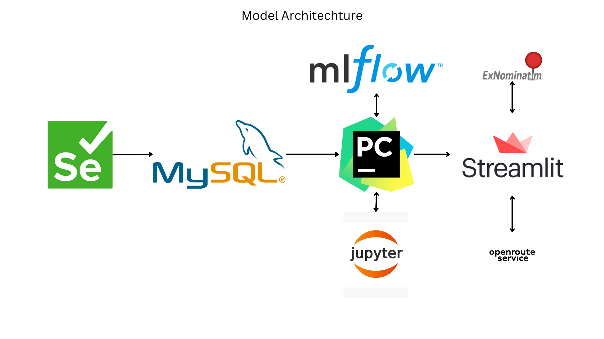

## Approach
### 1. Data Collection 
- **Data Scrapping**: Data was scrapped from the Uber website using Selenium.
- **Types of Data**: Data collected was from 7 locations and all their possible routes among them including ride type, ride request date, ride request time, waiting_time, reaching_time, and ride_price 

### Data collected so far as of 10:45 AM 19-09-2024

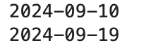
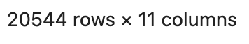
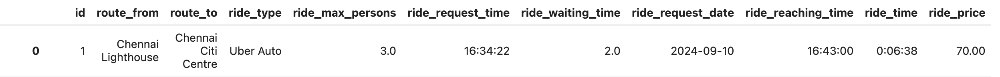


### 2. Data Preprocessing and Exploration
- **Data Cleaning**: Handled missing data, and format inconsistencies.
- **Exploratory Data Analysis (EDA)**: Analyzed ride times, ride prices, waiting times across the different locations and it's routes
- **Feature Engineering** : Added additional features such as ride time, day of week, hour of day which are all beneficial to the analysis.

### 3. Model Selection and Training with hyperparamter tuning:
- **Model Selection**: Machine learning models like Linear Regression, Random Forest, and XGBoost Models were used
- **Encoding and Scaling**: Categorical variables were one hot encoded and numerical variables were scaled.
- **Train-Test Split**: Data split into train and test datasets for the model to be evaluated with unseen data
- **Best Model** Random Forest performed the best among them

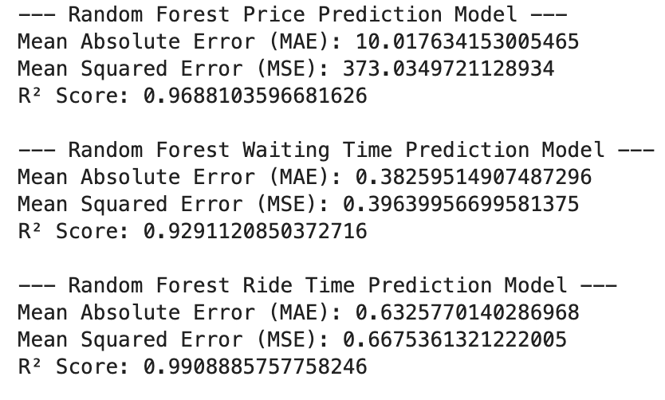

### 4. Further Improvement:
- **Including Extra Features**: In order to improve our model is by includes latitudes and longitudes of the locations and distance between them to then train the model to see if this is possible so as to be able to widen our location variables.
- **APIs for Latitudes,Longitudes, and Distance**: Nominatim API was used to obtain latitudes, longitudes and Open Route Service API was used to get the distance for all the possible distances

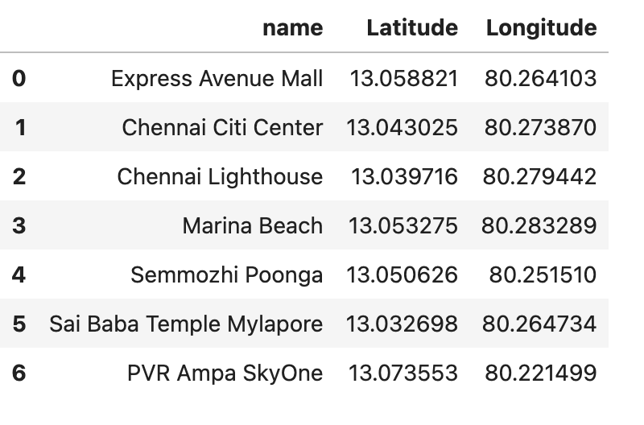
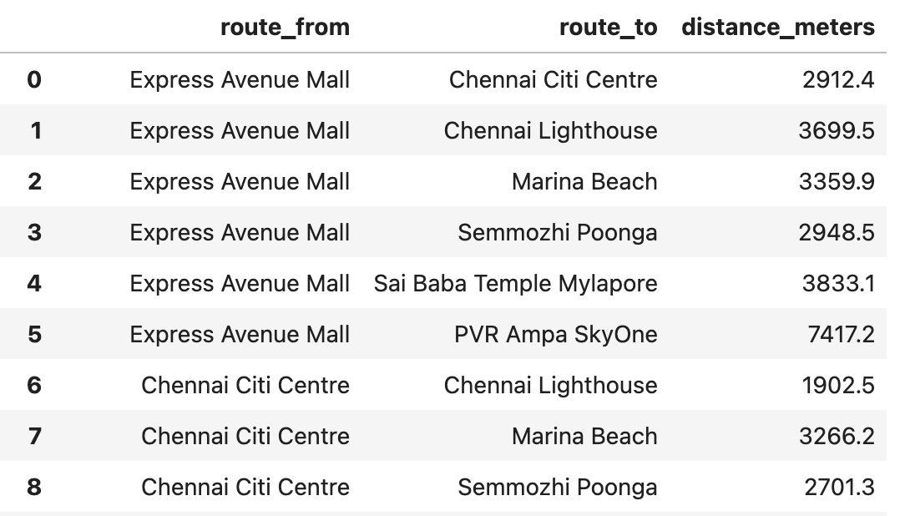

### 5. Model Training and Testing on New Data:
- **Encoding and Scaling**: Similarly categorical variables were one hot encoded and numerical variables were scaled.
- **Train-Test-Split**: For this we don't do a random split but we used but we hide two location pairs and all it's possible occurance between any of the two locations and all the other locations to see if it able to learn from the new values
- **Evaluation**: After training, testing and tuning. Random Forest seems to be performing the best


### 6. Interactive Web Application:
- **Web App**: Streamlit was utilized to convert the process into an interactive web application.
- **Location Restriction**: Since the data collected was only from 7 locations in the city of Chennai, the best method was to restrict the selection of locations for from and to to be within 20 km of the mean of the other 7 locations. That way we can get accurate predictions of our values.
- **Routes Mapping**: Routes was also mapped to give a visual appearance of the users selectedroute using Open Route Service API

## 7. Model Tracking and Updating:
- **NewData-NewModel** : New data means new model or model retraining, this was handled using ML Flow and includes choosing the best model from the list automatically through our code
- **Model-Tracking**: Using ML flow we can track the performance the models and make necessary adjustment to our model training by including additional features like more locations as time progresses

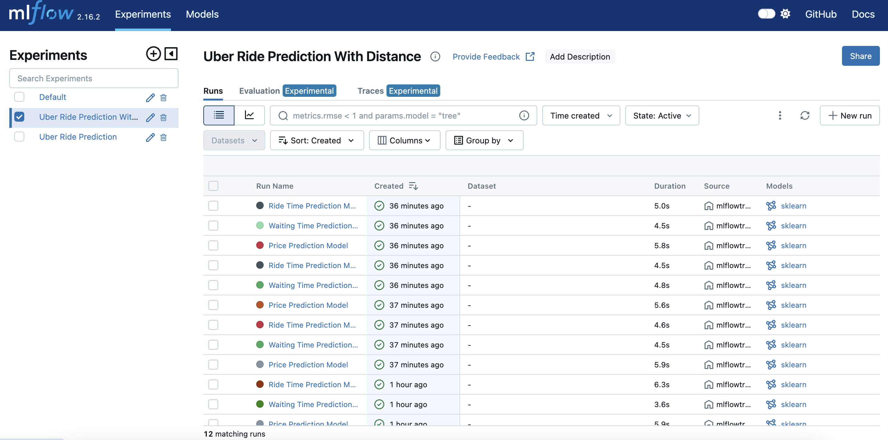

## Demo of the APP
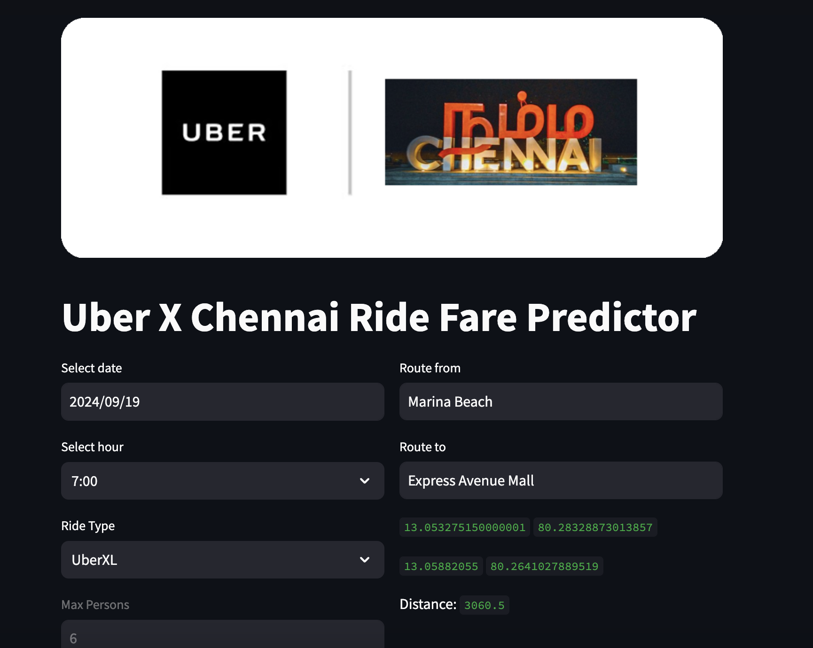
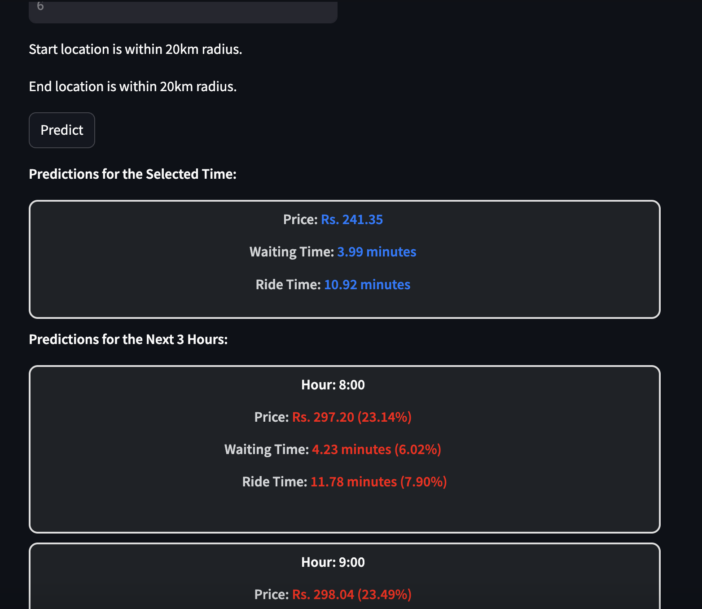
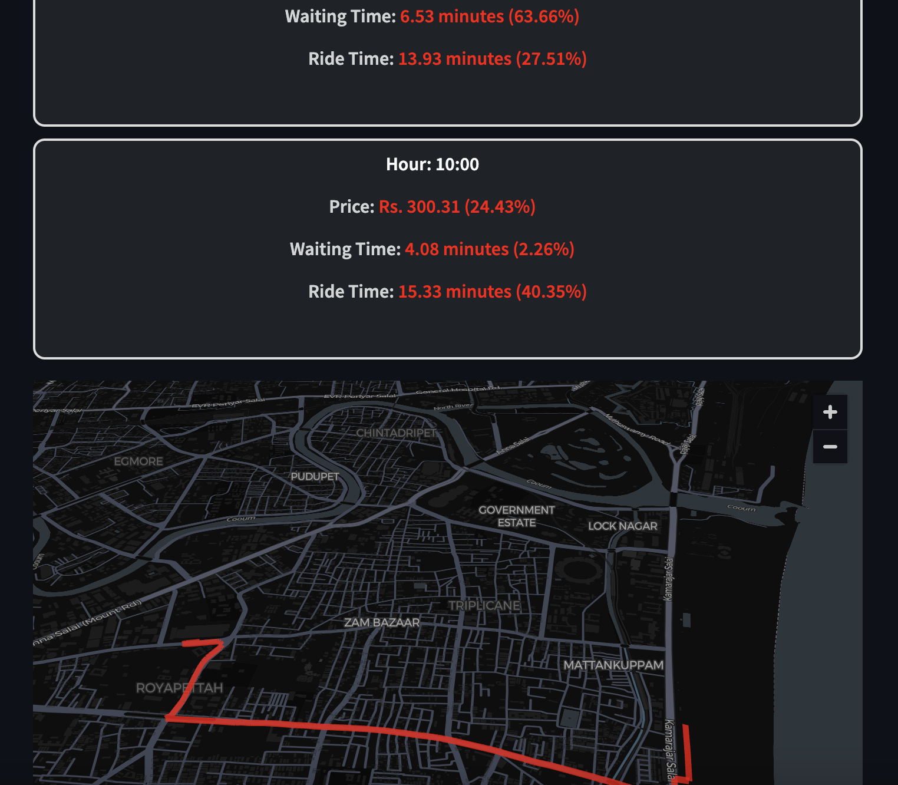
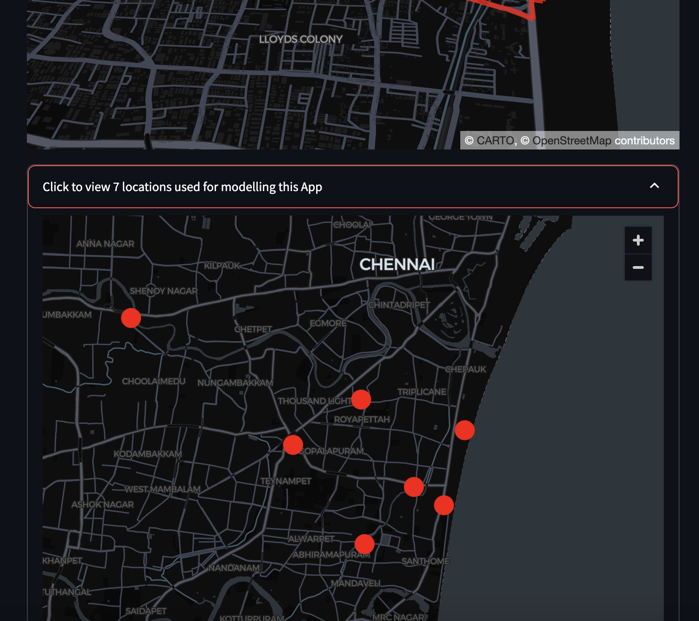

## Setup Instructions

1. **Install Required Packages:**
    ```bash
    pip install streamlit pandas scikit-learn geopy mlflow pydeck
    ```

2. **Clone Repository:**
    ```bash
    git clone https://github.com/pramodkondur/UberWise-EndtoEnd.git
    cd uber-price-prediction
    ```

3. **Configure MySQL Database:**
    - Set up MySQL to store the scraped Uber data.
    - Update database credentials accordingly.

4. **Run Streamlit Application:**
    ```bash
    streamlit run app.py
    ```

## Future Enhancements
- **Additional Routes:** Expand beyond Chennai to include other cities.
- **Live Integration with Uber API:** Direct integration for real-time Uber API access for better data accuracy.
---

This project provides users with an efficient, data-driven way to predict the best time to book an Uber ride, ensuring cost savings and convenience by analyzing real-time data and leveraging machine learning models.
